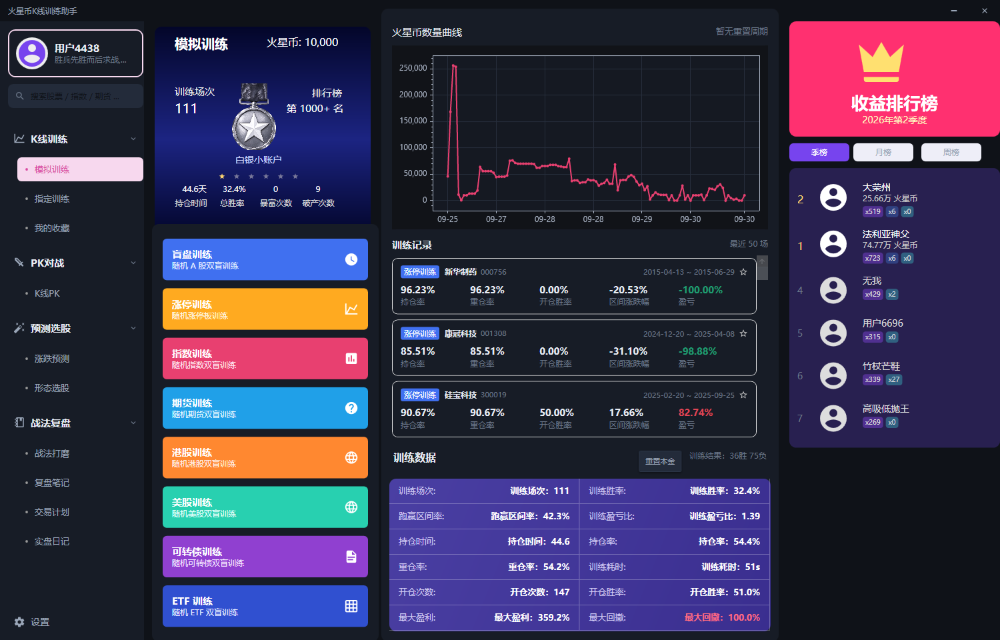
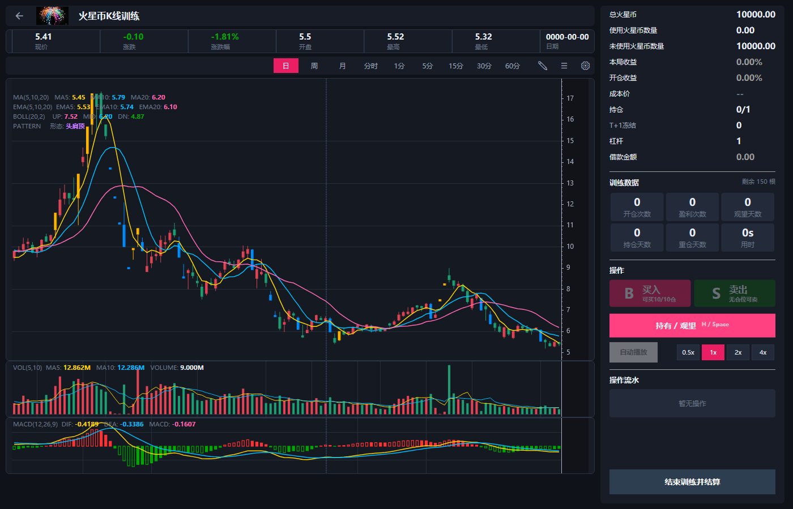
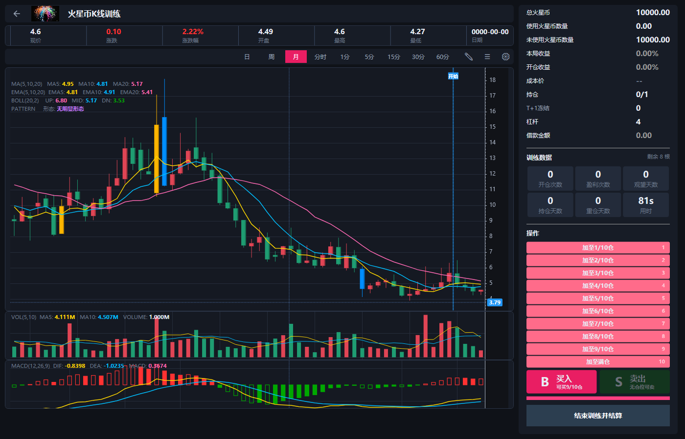
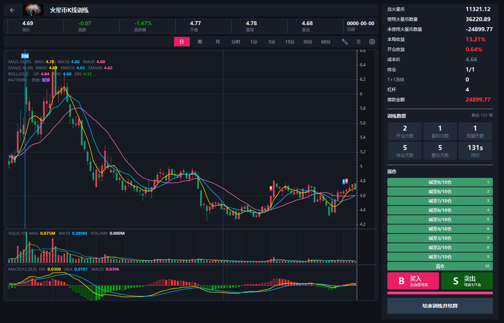
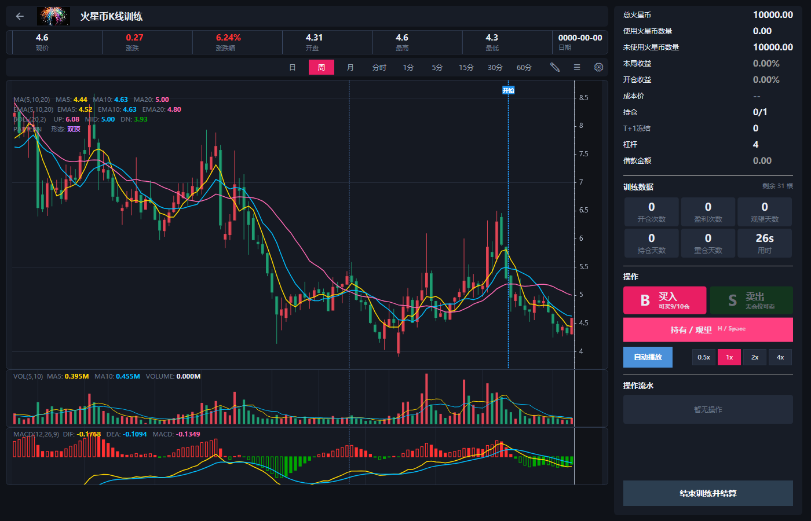
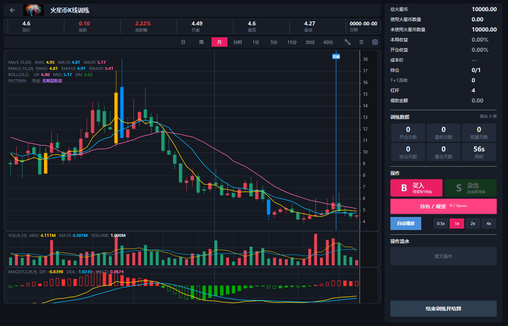
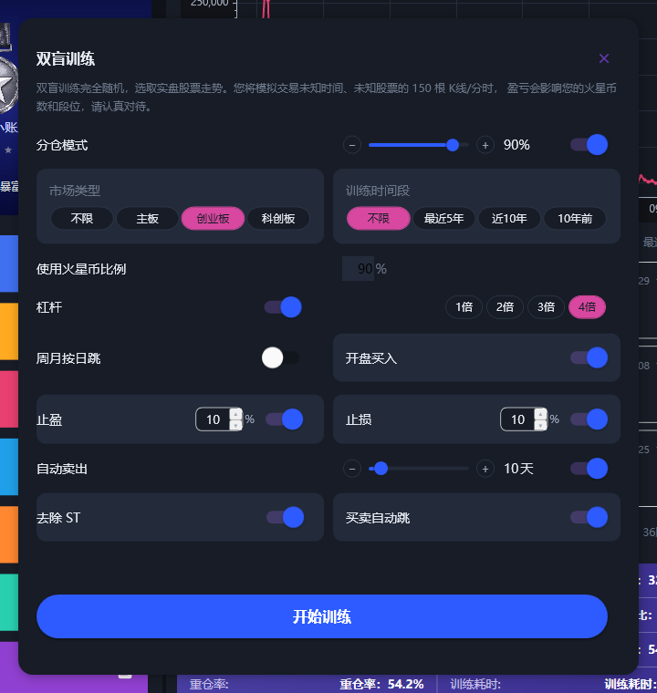
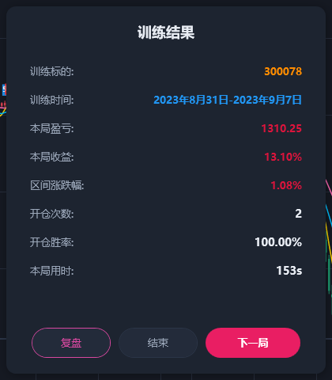
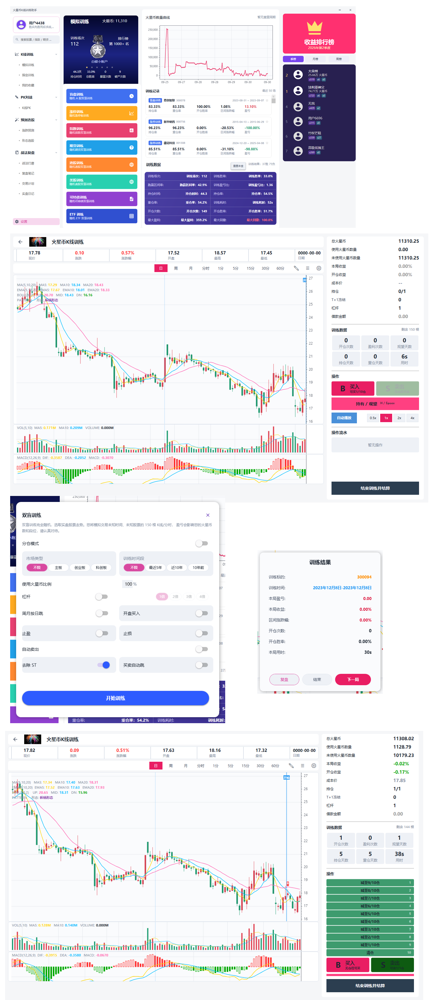

# StockKlineTrainer（火星币K线训练助手）

基于 **WPF + .NET 8 + ScottPlot 5 + SQLite** 的 K 线双盲训练工具：随机抽取真实历史行情，
隐藏股票名称与时间，模拟交易并逐根推进 K 线，训练盘感与交易纪律。

## ✨ 功能特性

- **8 大训练模式**：盲盘训练（A股）、涨停训练、指数训练、期货训练、港股训练、美股训练、可转债训练、ETF 训练
- **完整交易模拟**：买入/卖出（B/S 标记上图）、T+1 冻结 / T+0、手续费、分仓十档、1~4 倍杠杆、爆仓强平、止盈止损、自动卖出
- **日/周/月线切换**：同一局训练随时切换 K 线粒度，价位与盈亏三周期严格一致（不泄露未来数据）
- **双盲机制**：不显示真实股票名称与 K 线日期，训练完才揭晓答案
- **火星币资金系统**：本金跨局滚动，破产重置（归零即回 10000），暴富计数
- **段位系统**：按历史峰值定段（只升不降），结算跨档弹出升级庆祝窗
- **数据统计**：胜率/盈亏比/持仓率/最大回撤等 12 项聚合指标，逐局训练记录，火星币数量曲线
- **深/浅双主题**：一键切换，图表配色实时跟随

## 🖼 界面预览

### 首页（火星币曲线 / 训练记录 / 数据统计）


### K 线训练主界面


### 买入 / 卖出（B/S 标记）



### 周 / 月线切换



### 训练配置窗


### 结算结果


### 段位升级


### 深色 / 浅色主题



## 🚀 快速开始

### 环境要求
- Windows 10/11
- [.NET 8 SDK](https://dotnet.microsoft.com/download/dotnet/8.0)
- Visual Studio 2022（可选，用于编译；直接用 `dotnet run` 也行）

### 运行（使用仓库自带示例库，开箱即玩）
```bat
git clone https://github.com/boybeta/StockKlineTrainer.git
cd StockKlineTrainer
dotnet run
```
> 仓库自带 `stockdata/cy_stock.db` 为**演示示例库**（程序合成的随机数据，含 12 只演示股票 + 6 个指数，
> 仅供跑通程序，**不构成真实行情，训练结果无参考意义**）。

### 使用真实行情（推荐）
```bat
pip install -r tools/requirements.txt
python tools/build_stock_db.py        :: 约 10~30 分钟，覆盖沪深 A 股 + 6 个主要指数
```
生成后把 `cy_stock.db` 放到 `stockdata/` 目录（与 exe 同级）即可。

## 📁 数据格式约定（自建数据库必读）

程序通过 SQLite 读取行情，表结构与约定如下（自建库务必遵守）：

| 表 | 内容 | 关键字段 |
|---|---|---|
| `cy_stock_info` | 股票清单 | `code`, `name`, `is_st` |
| `cy_daily` | A 股日线（含预算指标列，可留空自动现算） | `code`, `trade_date`, `open`, `high`, `low`, `close`, `volume` |
| `cy_index_daily` | 指数日线 | 同上（无指标列） |
| `cy_us_daily` / `cy_hk_daily` / `cy_future_daily` / `cy_bond_daily` | 美股 / 港股 / 期货 / 转债日线 | 同上 |

**约定：**
- `trade_date` 必须是 **`yyyyMMdd` 字符串**（如 `20251231`），程序全部按字符串比较；
- 程序查询数据截止 **2025-12-31**，拉数据时 `end_date` 不要超过该日期；
- 港股/美股/期货/转债表留空也能启动程序，对应训练入口会提示数据不足（生成脚本欢迎 PR 补充）。

## 🗂 项目结构

```
StockKlineTrainer/
├── Views/            窗口（首页 / 训练窗 / 配置窗 / 结算窗 / 升级弹窗）
├── ViewModels/       训练逻辑与图表绑定（MainViewModel）
├── Services/         数据库 / 涨停票池 / 指标计算 / 主题 / 段位 / 路径管理
├── Models/           数据模型
├── Themes/           深/浅色资源字典
├── images/           段位徽章等运行时资源
├── stockdata/        训练数据库（示例库已内置，真库自行生成勿提交）
└── tools/            数据库生成脚本（akshare 全量 / 示例库合成）
```

## ⚠️ 免责声明

本项目仅供学习与技术交流，不构成任何投资建议。使用真实行情数据时请遵守数据源的相关协议。

## 📄 协议

[MIT License](LICENSE)
